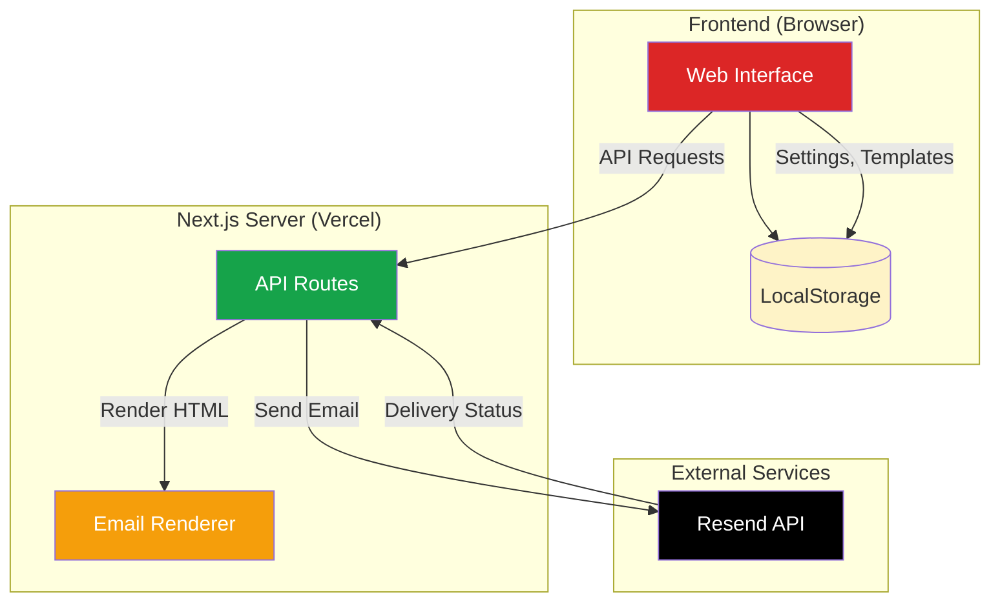
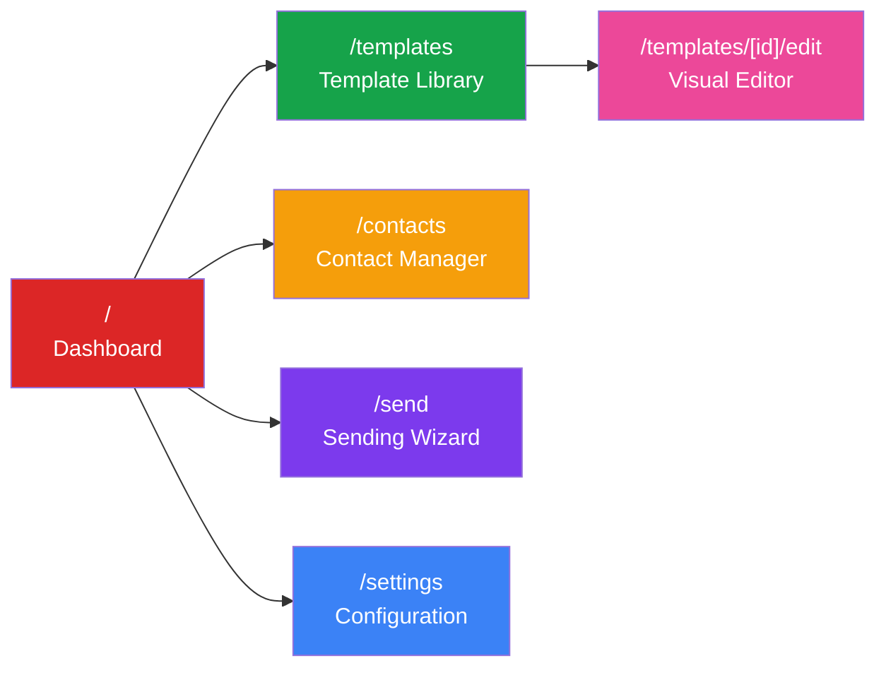
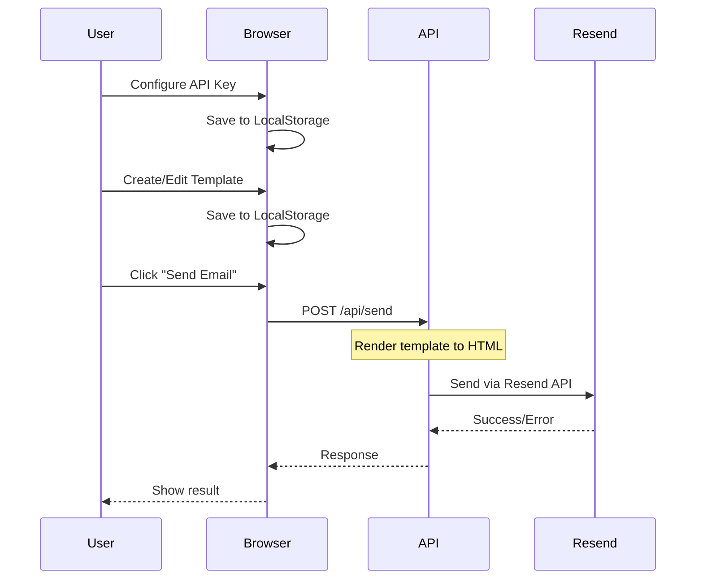
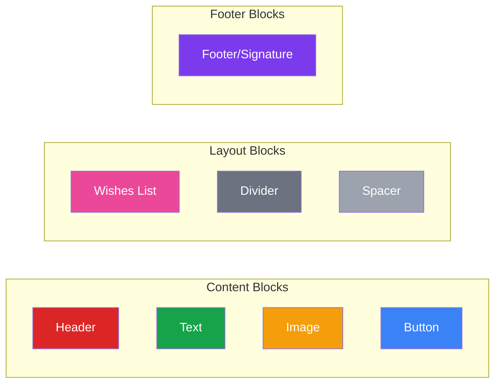

# Email Template Platform

[](https://choosealicense.com/licenses/mit/)
[](https://nextjs.org/)
[](https://react.dev/)
[](https://www.typescriptlang.org/)
[](https://tailwindcss.com/)
[](https://resend.com/)
[](https://christmas-greeting-email.vercel.app/)

A visual email template platform for creating and sending beautiful holiday greetings, marketing emails, and newsletters. Features a bold **Neobrutalism** design style with an intuitive drag-and-drop editor.

## 🌐 Live Demo

**[https://christmas-greeting-email.vercel.app/](https://christmas-greeting-email.vercel.app/)**

No installation required! Use the platform directly in your browser.

---

## ✨ Features

### 🎨 Visual Template Editor
- **Block-based editing** - Drag and drop content blocks
- **Real-time preview** - See changes instantly
- **Device preview** - Desktop and mobile views
- **Theme customization** - Colors, typography, and spacing

### 📧 Email Templates
- **Holiday Greetings** - Christmas, New Year, Chinese New Year, Birthday
- **Marketing Emails** - Product launches, promotions
- **Newsletters** - Weekly digest, company updates

### 👥 Contact Management
- **Local storage** - Contacts saved in your browser
- **Resend sync** - Import/export with Resend Audiences
- **Bulk operations** - Add, edit, delete multiple contacts

### 🚀 Easy Sending
- **Step-by-step wizard** - Guided email sending process
- **Personalization** - Dynamic variables like `{{recipientName}}`
- **Batch sending** - Send to multiple recipients

### 🎯 User-Friendly Design
- **No coding required** - Visual interface for non-technical users
- **Neobrutalism UI** - Bold, modern design aesthetic
- **Responsive layout** - Works on desktop and tablet

---

## 🏗️ System Architecture

### Application Overview



### Page Structure



### Data Flow



---

## 🚀 Getting Started

### Option 1: Use the Deployed Version (Recommended)

1. Visit **[https://christmas-greeting-email.vercel.app/](https://christmas-greeting-email.vercel.app/)**
2. Go to **Settings** and enter your Resend API Key
3. Add your contacts
4. Choose a template and start sending!

### Option 2: Run Locally

```bash
# Clone the repository
git clone https://github.com/ChanMeng666/christmas-greeting-email.git
cd christmas-greeting-email

# Install dependencies
npm install

# Start development server
npm run dev

# Open http://localhost:3000
```

### Option 3: Deploy Your Own

[](https://vercel.com/new/clone?repository-url=https://github.com/ChanMeng666/christmas-greeting-email)

---

## 📖 User Guide

For detailed usage instructions, see **[TUTORIAL.md](./TUTORIAL.md)**.

Quick overview:

| Step | Action | Description |
|------|--------|-------------|
| 1 | Configure Settings | Enter your Resend API Key |
| 2 | Add Contacts | Add recipients manually or sync from Resend |
| 3 | Choose Template | Select from preset templates |
| 4 | Customize | Edit content, colors, and images |
| 5 | Preview | Check how the email looks |
| 6 | Send | Use the wizard to send emails |

---

## 🛠️ Tech Stack

### Frontend
| Technology | Version | Purpose |
|------------|---------|---------|
| [Next.js](https://nextjs.org/) | 15 | React framework with App Router |
| [React](https://react.dev/) | 19 | UI component library |
| [TypeScript](https://www.typescriptlang.org/) | 5.7 | Type safety |
| [Tailwind CSS](https://tailwindcss.com/) | 3.4 | Utility-first CSS |
| [shadcn/ui](https://ui.shadcn.com/) | - | UI component system |
| [Zustand](https://zustand-demo.pmnd.rs/) | 5.0 | State management |
| [dnd-kit](https://dndkit.com/) | 6.1 | Drag and drop |
| [Lucide React](https://lucide.dev/) | 0.468 | Icon library |

### Backend & Services
| Technology | Version | Purpose |
|------------|---------|---------|
| [React Email](https://react.email/) | 0.0.31 | Email template components |
| [Resend](https://resend.com/) | 4.0.1 | Email delivery API |
| [Vercel](https://vercel.com/) | - | Hosting & serverless functions |

---

## 📁 Project Structure

```
email-template-platform/
├── app/                          # Next.js App Router
│   ├── page.tsx                  # Dashboard homepage
│   ├── layout.tsx                # Root layout with sidebar
│   ├── globals.css               # Global styles + Tailwind
│   ├── templates/
│   │   ├── page.tsx              # Template library
│   │   └── [id]/edit/page.tsx    # Visual editor
│   ├── contacts/page.tsx         # Contact management
│   ├── send/page.tsx             # Sending wizard
│   ├── settings/page.tsx         # Configuration
│   └── api/
│       ├── send/route.ts         # Email sending endpoint
│       ├── contacts/route.ts     # Resend contacts sync
│       └── preview/route.ts      # Template rendering
├── components/
│   ├── ui/                       # shadcn/ui components
│   └── shared/
│       └── Sidebar.tsx           # Navigation sidebar
├── lib/
│   └── utils.ts                  # Utility functions
├── types/
│   └── template.ts               # TypeScript definitions
├── src/                          # Legacy CLI tools
│   ├── config.ts
│   ├── index.ts
│   ├── contacts.ts
│   ├── preview.ts
│   └── templates/
│       └── christmas-email.tsx
└── public/                       # Static assets
```

---

## 🎨 Template System

### Preset Templates

| Template | Type | Description |
|----------|------|-------------|
| 🎄 Classic Christmas | Holiday | Neobrutalism-styled Christmas greeting |
| 🎆 New Year 2025 | Holiday | Purple and gold celebration theme |
| 🧧 Chinese New Year | Holiday | Traditional red and gold design |
| 🎂 Birthday Wishes | Holiday | Colorful birthday celebration |
| 🚀 Product Launch | Marketing | Bold product announcement |
| 📰 Weekly Newsletter | Newsletter | Clean, professional digest |

### Block Types



### Theme Configuration

| Property | Default | Description |
|----------|---------|-------------|
| `primaryColor` | `#DC2626` | Main accent color (red) |
| `secondaryColor` | `#16A34A` | Secondary color (green) |
| `accentColor` | `#F59E0B` | Highlight color (gold) |
| `borderWidth` | `4px` | Neobrutalism border thickness |
| `shadowOffset` | `8px` | Hard shadow offset |

---

## 🔌 API Endpoints

### POST `/api/send`

Send an email via Resend.

```typescript
// Request body
{
  apiKey: string,      // Resend API key
  from: string,        // Sender email
  to: string | string[],
  subject: string,
  html: string         // Rendered HTML
}

// Response
{
  success: boolean,
  data?: { id: string },
  error?: string
}
```

### GET `/api/contacts`

List contacts from Resend Audience.

```typescript
// Query params
?apiKey=re_xxx&audienceId=xxx

// Response
{
  success: boolean,
  contacts: Array<{
    email: string,
    firstName?: string,
    lastName?: string
  }>
}
```

### POST `/api/preview`

Render template blocks to HTML.

```typescript
// Request body
{
  blocks: Block[],
  theme: ThemeConfig,
  variables: Record<string, string>
}

// Response
{
  success: boolean,
  html: string
}
```

---

## 🔐 Security

### Data Storage
- **API keys** are stored in browser localStorage only
- **No server-side storage** of user credentials
- **API keys** are sent per-request and not persisted on server

### Best Practices
- Use environment variables for local development
- Never commit `.env` files to version control
- Create separate Resend API keys for development/production

---

## 🤝 Contributing

Contributions are welcome! Please feel free to submit a Pull Request.

1. Fork the repository
2. Create your feature branch (`git checkout -b feature/AmazingFeature`)
3. Commit your changes (`git commit -m 'Add some AmazingFeature'`)
4. Push to the branch (`git push origin feature/AmazingFeature`)
5. Open a Pull Request

---

## 📄 License

This project is licensed under the MIT License - see the [LICENSE](LICENSE) file for details.

---

## 👤 Author

**Chan Meng**

- Website: [chanmeng.live](https://chanmeng.live/)
- LinkedIn: [chanmeng666](https://www.linkedin.com/in/chanmeng666/)
- GitHub: [ChanMeng666](https://github.com/ChanMeng666)

---

## 🙏 Acknowledgments

- [Resend](https://resend.com/) - Email delivery API
- [React Email](https://react.email/) - Email template components
- [shadcn/ui](https://ui.shadcn.com/) - Beautiful UI components
- [Vercel](https://vercel.com/) - Hosting platform
