# Email Template Platform - User Tutorial

This comprehensive guide will walk you through every feature of the Email Template Platform, from initial setup to sending your first email campaign.

## Table of Contents

1. [Getting Started](#1-getting-started)
2. [Setting Up Your Account](#2-setting-up-your-account)
3. [Managing Contacts](#3-managing-contacts)
4. [Working with Templates](#4-working-with-templates)
5. [Using the Visual Editor](#5-using-the-visual-editor)
6. [Sending Emails](#6-sending-emails)
7. [Troubleshooting](#7-troubleshooting)
8. [FAQ](#8-faq)

---

## 1. Getting Started

### 1.1 Accessing the Platform

You can access the Email Template Platform in two ways:

**Option A: Use the Live Version (Recommended)**

Simply visit: **[https://christmas-greeting-email.vercel.app/](https://christmas-greeting-email.vercel.app/)**

No installation or download required!

**Option B: Run Locally**

If you prefer to run the platform on your own computer:

```bash
git clone https://github.com/ChanMeng666/christmas-greeting-email.git
cd christmas-greeting-email
npm install
npm run dev
```

Then open `http://localhost:3000` in your browser.

### 1.2 Platform Overview

When you first open the platform, you'll see the Dashboard:


**Navigation Sidebar** (left side):
- **Home** - Dashboard overview
- **Templates** - Browse and edit email templates
- **Contacts** - Manage your recipients
- **Send** - Send email campaigns
- **Settings** - Configure API keys and sender info

---

## 2. Setting Up Your Account

Before you can send emails, you need to configure your Resend API settings.

### 2.1 Getting a Resend API Key


**Step-by-step instructions:**

1. **Visit Resend**: Go to [resend.com](https://resend.com)
2. **Create an Account**: Click "Sign Up" and register with your email
3. **Verify Your Email**: Check your inbox and click the verification link
4. **Navigate to API Keys**: Go to [resend.com/api-keys](https://resend.com/api-keys)
5. **Create a New Key**:
   - Click "Create API Key"
   - Give it a name (e.g., "Email Platform")
   - Select "Full access" for permissions
   - Click "Create"
6. **Copy Your Key**: Your API key will look like `re_xxxxxxxxxx`

> ⚠️ **Important**: Save your API key securely. It will only be shown once!

### 2.2 Verifying Your Domain (Optional but Recommended)

To send emails from your own domain (e.g., `hello@yourdomain.com`):

1. Go to [resend.com/domains](https://resend.com/domains)
2. Click "Add Domain"
3. Enter your domain name
4. Add the DNS records provided by Resend:

| Type | Name | Value |
|------|------|-------|
| TXT | `resend._domainkey` | (provided by Resend) |
| TXT | `@` or `_resend` | (provided by Resend) |

5. Wait 5-30 minutes for DNS propagation
6. Click "Verify" in Resend Dashboard

> 💡 **Tip**: If you don't have a domain, you can use `onboarding@resend.dev` for testing (only sends to your own email).

### 2.3 Configuring the Platform

1. Click **Settings** in the sidebar
2. Fill in the following fields:

| Field | Description | Example |
|-------|-------------|---------|
| **Resend API Key** | Your API key from Step 2.1 | `re_AbCdEf123456...` |
| **Sender Email** | Your verified sender address | `hello@yourdomain.com` |
| **Sender Name** | Display name for recipients | `John Smith` |
| **Audience ID** (optional) | For syncing contacts | `dc18b68d-cd0a-...` |

3. Click **Save Settings**


---

## 3. Managing Contacts

The Contacts page lets you manage all your email recipients.

### 3.1 Adding Contacts Manually

1. Go to **Contacts** in the sidebar
2. Click the **Add Contact** button
3. Fill in the contact information:
   - **Email** (required)
   - **First Name** (optional)
   - **Last Name** (optional)
4. Click **Add Contact**


### 3.2 Editing Contacts

1. Find the contact in the list
2. Click the **Edit** icon (pencil)
3. Modify the information
4. Click **Save**

### 3.3 Deleting Contacts

1. Find the contact in the list
2. Click the **Delete** icon (trash)
3. Confirm deletion

### 3.4 Searching Contacts

Use the search bar at the top to filter contacts by:
- Email address
- First name
- Last name

### 3.5 Syncing with Resend Audience (Advanced)

If you have an Audience ID configured in Settings:

1. Click **Sync Resend** button
2. Contacts will be imported from your Resend Audience
3. Any changes will sync back to Resend


### 3.6 Importing from CSV (Coming Soon)

Click **Import CSV** to bulk import contacts from a spreadsheet.

Expected CSV format:
```csv
email,firstName,lastName
john@example.com,John,Doe
jane@example.com,Jane,Smith
```

---

## 4. Working with Templates

The Templates page displays all available email templates.

### 4.1 Template Categories

```mermaid
graph TB
    subgraph "Holiday Templates"
        XMAS[🎄 Christmas]
        NY[🎆 New Year]
        CNY[🧧 Chinese New Year]
        BDAY[🎂 Birthday]
    end

    subgraph "Marketing Templates"
        LAUNCH[🚀 Product Launch]
        PROMO[💰 Promotion]
    end

    subgraph "Newsletter Templates"
        WEEKLY[📰 Weekly Digest]
        UPDATE[📢 Company Update]
    end

    style XMAS fill:#DC2626,color:#fff
    style NY fill:#7C3AED,color:#fff
    style CNY fill:#EF4444,color:#fff
    style BDAY fill:#EC4899,color:#fff
    style LAUNCH fill:#F59E0B,color:#fff
    style PROMO fill:#10B981,color:#fff
    style WEEKLY fill:#3B82F6,color:#fff
    style UPDATE fill:#6366F1,color:#fff
```



### 4.2 Browsing Templates

1. Go to **Templates** in the sidebar
2. Use the filter tabs to narrow down:
   - **All** - Show all templates
   - **Holiday** - Greeting cards
   - **Marketing** - Promotional emails
   - **Newsletter** - Regular updates
3. Hover over a template to see options:
   - **Edit** - Open in visual editor
   - **Copy** - Duplicate the template

### 4.3 Selecting a Template

1. Click on any template card
2. You'll be taken to the visual editor
3. Customize the template to your needs

---

## 5. Using the Visual Editor

The Visual Editor is the heart of the platform, allowing you to customize email templates without any coding.

### 5.1 Editor Layout


The editor has three main panels:

| Panel | Location | Purpose |
|-------|----------|---------|
| **Block Palette** | Left | Add new content blocks |
| **Canvas** | Center | View and edit your email |
| **Properties Panel** | Right | Customize selected block |

### 5.2 Available Blocks

| Block | Icon | Description |
|-------|------|-------------|
| **Header** | 📝 | Title and subtitle section |
| **Text** | 📄 | Paragraph or content text |
| **Image** | 🖼️ | Photo or graphic |
| **Button** | 🔘 | Call-to-action link |
| **Wishes List** | ⭐ | Bulleted list with icons |
| **Divider** | ➖ | Horizontal separator |
| **Footer** | 📍 | Sender signature |

### 5.3 Adding a Block

1. In the left panel, find the block type you want
2. Click the **+** button next to it
3. The block will be added to your email


### 5.4 Editing a Block

1. Click on any block in the canvas
2. The block will be highlighted
3. The Properties Panel (right) will show editing options
4. Make your changes - they save automatically

**Example: Editing a Header Block**

| Property | Description |
|----------|-------------|
| **Subtitle** | Small text above the title |
| **Title** | Main heading text |

**Example: Editing a Text Block**

| Property | Description |
|----------|-------------|
| **Content** | The main text content |

### 5.5 Reordering Blocks

1. In the left panel's "Blocks in Template" section
2. Drag blocks up or down to reorder
3. The canvas will update automatically

### 5.6 Deleting a Block

1. Find the block in the left panel list
2. Click the trash icon next to it
3. The block will be removed

### 5.7 Customizing Theme

When no block is selected, the Properties Panel shows theme options:

| Property | Description |
|----------|-------------|
| **Primary Color** | Main brand color (headers, accents) |
| **Secondary Color** | Supporting color (buttons, footers) |
| **Accent Color** | Highlight color (special elements) |

### 5.8 Using Variables

You can personalize emails using variables:

| Variable | Description | Example Output |
|----------|-------------|----------------|
| `{{recipientName}}` | Recipient's first name | "John" |
| `{{senderName}}` | Your name | "Jane Smith" |
| `{{currentYear}}` | Current year | "2025" |
| `{{nextYear}}` | Next year | "2026" |

**Example usage in text:**
```
Dear {{recipientName}},

Wishing you a wonderful {{nextYear}}!

Best regards,
{{senderName}}
```

### 5.9 Preview Modes

Use the toolbar to switch between:
- **Desktop** - Full-width preview (600px)
- **Mobile** - Mobile preview (375px)

### 5.10 Saving Your Template

1. Click the **Save** button in the toolbar
2. Your template is saved to browser storage
3. It will be available next time you visit

---

## 6. Sending Emails

The Send page guides you through the email sending process.

### 6.1 Sending Workflow


### 6.2 Step 1: Select Template

1. Go to **Send** in the sidebar
2. Browse available templates
3. Click on the template you want to use
4. Click **Next**

### 6.3 Step 2: Choose Recipients

1. View your contact list
2. Check the boxes next to recipients
3. Or click "Select All" to choose everyone
4. Click **Next**

> 💡 **Tip**: Make sure you've added contacts in the Contacts page first!

### 6.4 Step 3: Enter Subject

1. Type your email subject line
2. You can use variables like `{{recipientName}}`
3. Example: "🎄 Happy Holidays, {{recipientName}}!"
4. Click **Next**

### 6.5 Step 4: Preview Email

1. Review how your email will look
2. Check the recipient count
3. Verify the subject line
4. Click **Next** if everything looks good

### 6.6 Step 5: Send

1. Review the final summary:
   - Template name
   - Subject line
   - Number of recipients
2. Click **Send Emails**
3. Wait for confirmation


### 6.7 Understanding Send Results

After sending, you'll see:
- ✅ **Sent**: Successfully delivered to Resend
- ❌ **Failed**: Error occurred (check error message)

---

## 7. Troubleshooting

### 7.1 Common Issues

#### "API key is required"

**Problem**: You haven't configured your Resend API key.

**Solution**:
1. Go to Settings
2. Enter your Resend API key
3. Click Save

#### "Invalid API key"

**Problem**: Your API key is incorrect or expired.

**Solution**:
1. Go to [resend.com/api-keys](https://resend.com/api-keys)
2. Create a new API key
3. Update it in Settings

#### "Domain not verified"

**Problem**: Your sender email domain isn't verified in Resend.

**Solution**:
1. Go to [resend.com/domains](https://resend.com/domains)
2. Verify your domain with DNS records
3. Or use `onboarding@resend.dev` for testing

#### "No contacts found"

**Problem**: You haven't added any contacts yet.

**Solution**:
1. Go to Contacts page
2. Click Add Contact
3. Add at least one recipient

#### "Email not received"

**Problem**: Email may be in spam or delayed.

**Solutions**:
1. Check recipient's spam folder
2. Verify the email address is correct
3. Wait a few minutes (emails can be delayed)
4. Check Resend Dashboard for delivery status

### 7.2 Browser Issues

#### Data Lost After Closing Browser

**Problem**: Your browser may be clearing localStorage.

**Solutions**:
1. Disable "Clear data on close" in browser settings
2. Don't use Incognito/Private mode
3. Allow site data for this website

#### Page Not Loading

**Solutions**:
1. Clear browser cache
2. Try a different browser (Chrome, Firefox, Edge)
3. Disable ad blockers
4. Check internet connection

---

## 8. FAQ

### General Questions

**Q: Is this platform free to use?**

A: Yes, the platform is completely free. However, you need a Resend account for sending emails. Resend offers a free tier with 3,000 emails/month.

**Q: Do I need to install anything?**

A: No! Just visit the website and start using it. No downloads or installations required.

**Q: Where is my data stored?**

A: All your data (settings, contacts, templates) is stored in your browser's localStorage. It's never uploaded to any server.

**Q: Is my API key secure?**

A: Your API key is stored only in your browser and sent directly to Resend when needed. It's never stored on our servers.

### Templates

**Q: Can I create my own templates from scratch?**

A: Yes! Click "Create Template" on the Templates page to start with a blank canvas.

**Q: Can I import HTML templates?**

A: Currently, the platform uses a block-based system. Direct HTML import is not supported yet.

**Q: Why do my images not show?**

A: Images must be hosted on a public URL (HTTPS). Use services like:
- Vercel Blob
- Cloudinary
- Imgur
- AWS S3

### Sending

**Q: Is there a limit on how many emails I can send?**

A: The platform itself has no limit. Your limit depends on your Resend plan:
- Free: 3,000 emails/month
- Pro: 50,000 emails/month
- Enterprise: Unlimited

**Q: Can I schedule emails?**

A: This feature is coming soon! Currently, emails are sent immediately.

**Q: Can I track email opens and clicks?**

A: Tracking is available through your Resend Dashboard at [resend.com/emails](https://resend.com/emails).

### Technical

**Q: What browsers are supported?**

A: Modern browsers including:
- Chrome 90+
- Firefox 88+
- Safari 14+
- Edge 90+

**Q: Can I use this on mobile?**

A: The platform is optimized for desktop and tablet. Mobile editing is limited but possible.

**Q: Can I self-host this platform?**

A: Yes! Clone the GitHub repository and deploy to Vercel or any Node.js hosting platform.

---

## Need More Help?

- **GitHub Issues**: [Report bugs or request features](https://github.com/ChanMeng666/christmas-greeting-email/issues)
- **Resend Documentation**: [resend.com/docs](https://resend.com/docs)
- **Author**: [Chan Meng](https://github.com/ChanMeng666)

---

*Last updated: December 2024*
